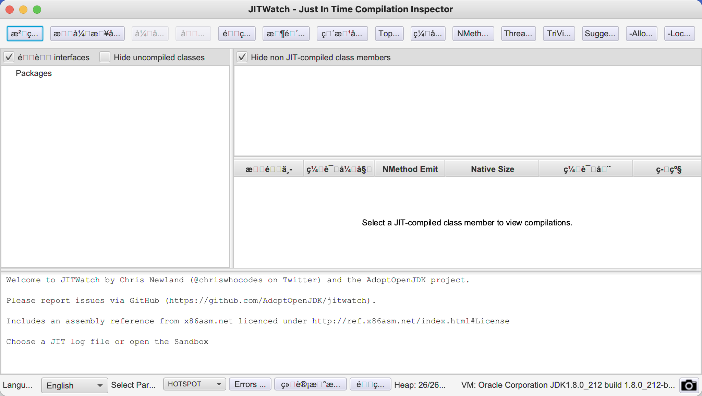
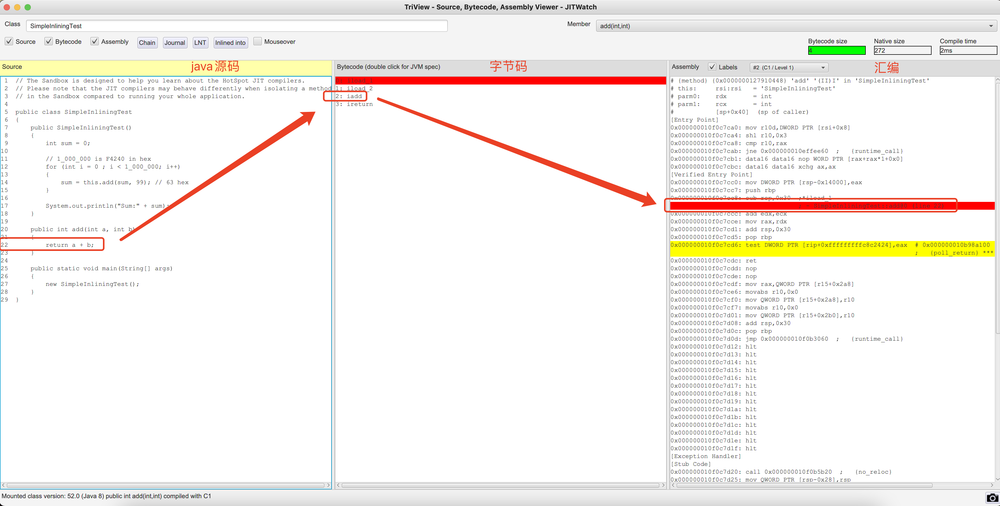

# hsdis && jitwatch
hsdis是java反汇编工具,可查看java汇编实现  
jitwatch不仅能够看到汇编实现，并且有UI界面版本可以切换汇编语言、查看字节码...   

# hsdis
## 环境搭建  
首先下载`hsdis`代码,本仓库就有源码，也可以自己下载源码:  
```shell
# 下载openjdk代码.默认master分支  
git clone https://github.com/openjdk/jdk.git

#进入hsdis源码目录
cd jdk/src/utils/hsdis

#下载binutils到 jdk/src/utils/hsdis 目录下 
wget https://ftp.gnu.org/gnu/binutils/binutils-2.35.1.tar.xz
tar -xf binutils-2.35.1.tar.xz

# 编译
make BINUTILS=binutils-2.35.1 ARCH=amd64
```

目前仓库中已有hsdis源码和binutils可以直接编译`tar -xf binutils-2.35.1.tar.xz;make BINUTILS=binutils-2.35.1 ARCH=amd64`  

编译成功后会生成hsdis库文件:  
```shell
# macos 生成的依赖库文件路径为 build/macosx-amd64/hsdis-amd64.dylib  
# 拷贝到java路径
sudo cp build/macosx-amd64/hsdis-amd64.dylib /Library/Java/JavaVirtualMachines/jdk1.8.0_181.jdk/Contents/Home/jre/lib/server/  

# linux系统生成的依赖库文件为 build/linux-amd64/hsdis-amd64.so
sudo cp build/linux-amd64/hsdis-amd64.so /usr/lib/jvm/java-8-oracle/jre/lib/amd64/server/  
```

实例代码:  
Demo.java  
```java
public class Demo {
    private int age;

    public void setAge(int age){
        this.age = age;
    }

    public int getAge(){
        return age;
    }

    public static void main(String[] args) {
        Demo demo = new Demo();
        demo.setAge(10);
        int a = demo.getAge();
    }
}

```

```shell
# 首先编译Demo，生成Demo.class文件
javac Demo.java

# 反汇编
java -XX:+UnlockDiagnosticVMOptions -XX:+PrintAssembly -Xcomp Demo > Demo.s  
```

[汇编文件样例](Demo.s)    

> 默认使用的是att汇编，习惯使用intel汇编，能够切换汇编语言吗?  

# jitwatch 
## 环境搭建  
[官网jar下载地址](https://github.com/AdoptOpenJDK/jitwatch/releases)  

也可以通过maven源码编译运行  
```
mvn clean compile test exec:java

# 运行jar包
java -jar jitwatch-ui-1.4.2-shaded-mac.jar 
```

亲测1.4.2以上的版本有乱码问题,请选择对应版本使用    
   


## 基本使用
###  debug  

配置汇编语言样式:  
<br>
<div align=center>
    </img>  
</div>
<br>


在主页面点击`Sandbox`>>`Run`就可以看到反汇编的结果了  
   

汇编代码示例:  
```
[Verified Entry Point]
  0x000000010f0c7980: mov    DWORD PTR [rsp-0x14000],eax
  0x000000010f0c7987: push   rbp
  0x000000010f0c7988: sub    rsp,0x30
  0x000000010f0c798c: movabs rax,0x1279106f0    ;   {metadata(method data for {method} {0x0000000127910448} 'add' '(II)I' in 'SimpleInliningTest')}
  0x000000010f0c7996: mov    edi,DWORD PTR [rax+0xdc]
  0x000000010f0c799c: add    edi,0x8
  0x000000010f0c799f: mov    DWORD PTR [rax+0xdc],edi
  0x000000010f0c79a5: movabs rax,0x127910448    ;   {metadata({method} {0x0000000127910448} 'add' '(II)I' in 'SimpleInliningTest')}
  0x000000010f0c79af: and    edi,0x1ff8
  0x000000010f0c79b5: cmp    edi,0x0
  0x000000010f0c79b8: je     0x000000010f0c79cf  ;*iload_1
                                                ; - SimpleInliningTest::add@0 (line 22)

  0x000000010f0c79be: add    edx,ecx
  0x000000010f0c79c0: mov    rax,rdx
  0x000000010f0c79c3: add    rsp,0x30
  0x000000010f0c79c7: pop    rbp
  0x000000010f0c79c8: test   DWORD PTR [rip+0xfffffffffc8c2732],eax        # 0x000000010b98a100
                                                ;   {poll_return}
  0x000000010f0c79ce: ret    
  0x000000010f0c79cf: mov    QWORD PTR [rsp+0x8],rax
  0x000000010f0c79d4: mov    QWORD PTR [rsp],0xffffffffffffffff
  0x000000010f0c79dc: call   0x000000010f0b8420  ; OopMap{rsi=Oop off=129}
                                                ;*synchronization entry
                                                ; - SimpleInliningTest::add@-1 (line 22)
                                                ;   {runtime_call}
```


